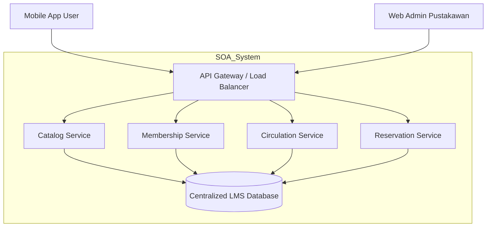
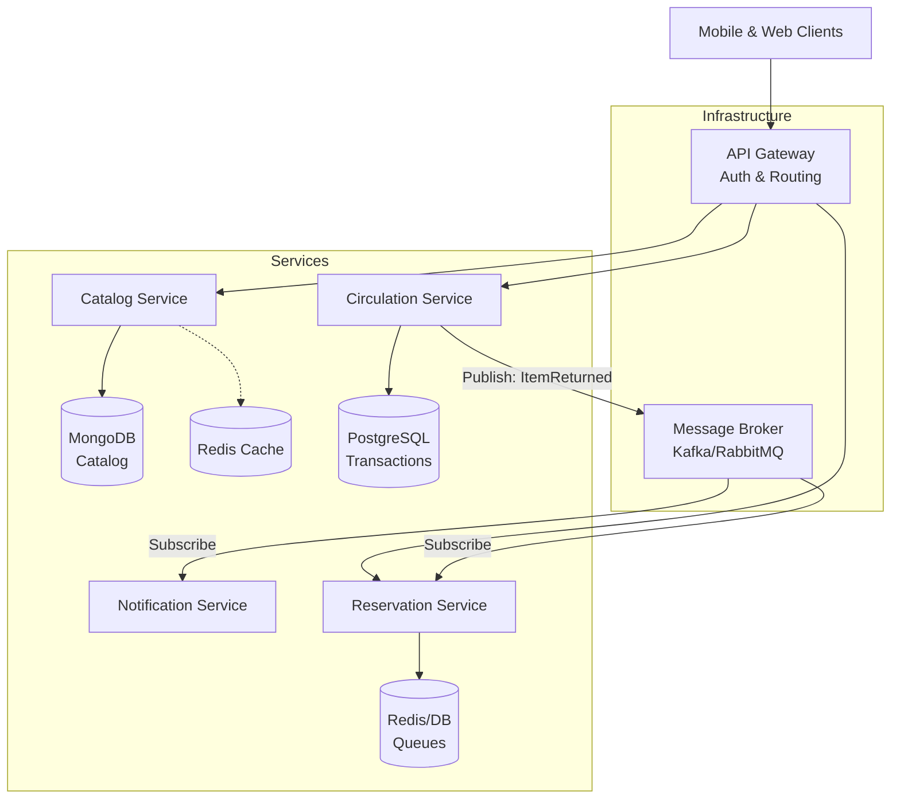
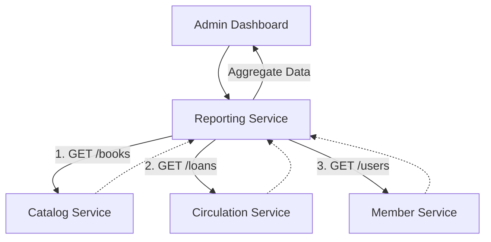
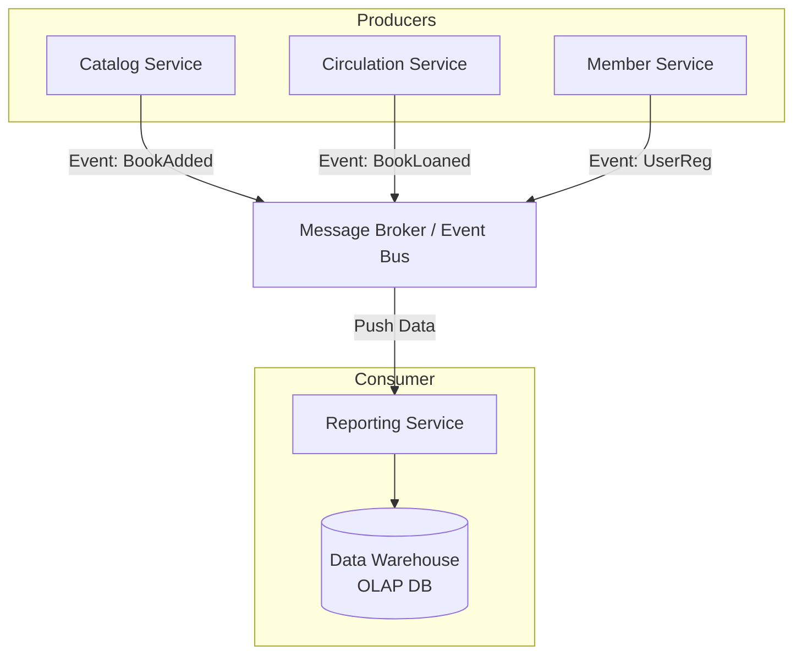

# 🚀 MLOps Pipeline: Real-time Crypto Prediction Dashboard





Dokumen ini berisi dokumentasi teknis, arsitektur, dan panduan setup untuk infrastruktur MLOps yang berjalan di atas **Minikube (Kubernetes)**. Proyek ini bertujuan untuk mensimulasikan lingkungan produksi *end-to-end* untuk prediksi harga aset kripto, dengan fokus pada otomatisasi infrastruktur dan siklus hidup model (Model Lifecycle).

---

## 🏗️ Arsitektur & Alur Data (Data Flow)

Saat ini, sistem beroperasi dengan **Hybrid Setup**:
* **Infrastructure (Storage/DB/Tracking):** Berjalan di dalam Cluster Kubernetes (Minikube).
* **Execution Logic (Training/Serving):** Berjalan di Local Host (Laptop) yang terhubung via *Port Forwarding*.

### Diagram Arsitektur

```mermaid
graph TD
    subgraph Local Environment
        Gen[Mock Data Script]
        Train[Training Script]
        Serve[Serving API - FastAPI]
        User[User / Dashboard]
    end

    subgraph Minikube Cluster
        Postgres[(PostgreSQL)]
        MinIO[(MinIO Artifact Store)]
        MLflow[(MLflow Tracking Server)]
        MLflowDB[(MLflow DB Metadata)]
    end

    Gen -- Write Data --> Postgres
    Postgres -- Read Data --> Train
    Train -- Log Metrics --> MLflow
    Train -- Save Model --> MinIO
    Train -- Log Metadata --> MLflowDB
    Serve -- Load Model --> MinIO
    User -- Request Prediction --> Serve
````

### Penjelasan Alur

1.  **Ingestion (Simulasi):** Script `mock_data.py` membuat data dummy harga Bitcoin dan menyimpannya ke PostgreSQL.
2.  **Training:** Script `train.py` mengambil data dari PostgreSQL, melatih model *Linear Regression*, dan mencatat hasilnya (RMSE, Params).
3.  **Model Registry:**
      * Metadata eksperimen dicatat di **MLflow Tracking Server**.
      * File Model fisik (pickle/binary) disimpan di **MinIO (Object Storage)**.
4.  **Serving:** Script `serve.py` otomatis mencari model terbaik dari MLflow/MinIO, mendownloadnya, dan menyajikannya via REST API menggunakan **FastAPI**.

-----

## 🛠️ Technology Stack & Justifikasi

Berikut adalah alasan pemilihan teknologi (*Rationale*) untuk memenuhi batasan tugas kuliah (Local Kubernetes):

| Komponen | Teknologi | Justifikasi / Rasionalisasi |
| :--- | :--- | :--- |
| **Infrastructure** | **Minikube** | *Constraint Wajib.* Mensimulasikan lingkungan cloud native (AWS/GCP) di laptop lokal secara hemat resource. |
| **Database** | **PostgreSQL** | Standar industri untuk data terstruktur (*Time-series* harga crypto). Stabil dan memiliki dukungan luas di Helm Charts. |
| **Object Storage** | **MinIO** | *S3-Compatible.* Solusi open-source terbaik untuk menggantikan AWS S3 di lingkungan lokal. MLflow membutuhkan S3-API untuk menyimpan artifact model. |
| **Tracking** | **MLflow** | Standar *de facto* MLOps untuk manajemen siklus hidup model. Memisahkan code, data, dan model versioning dengan rapi. |
| **Orchestration** | **n8n** | *Low-Code Automation.* Dipilih karena antarmuka visual (node-based) memudahkan manajemen workflow tanpa perlu koding backend yang kompleks (Cronjob/Airflow terlalu berat). |
| **Serving** | **FastAPI** | Modern Python framework yang sangat cepat (*asynchronous*). Otomatis menghasilkan dokumentasi (Swagger UI) sehingga memudahkan integrasi dengan Frontend. |

-----

## ⚙️ Cara Install & Setup

### Prerequisites

  * Windows 10/11 dengan **Docker Desktop** & **Minikube** terinstall.
  * **Helm CLI** dan **Kubectl**.
  * **Python 3.10+** (dengan pip).

### 1\. Setup Infrastruktur (Minikube)

Jalankan perintah berikut di PowerShell/CMD administrator:

```powershell
# 1. Nyalakan Cluster
minikube start --driver=docker --memory=4096 --cpus=2

# 2. Install PostgreSQL
helm install my-db bitnami/postgresql --namespace mlops-system --set auth.postgresPassword=password123 --set auth.database=mlflow_db

# 3. Install MinIO (Storage)
helm install my-minio bitnami/minio --namespace mlops-system --set auth.rootUser=admin --set auth.rootPassword=password123 --set mode=standalone --set image.tag=latest
```

> **Note:** Setup Bucket MLflow wajib dilakukan manual atau via script terpisah menggunakan MinIO Client (`mc`).
>
> ```powershell
> mc.exe alias set myminio http://localhost:9000 admin password123
> mc.exe mb myminio/mlflow
> ```

```powershell
# 4. Install MLflow (Tracking Server)
# Menghubungkan MLflow ke Postgres & MinIO sekaligus
helm install my-mlflow community-charts/mlflow --namespace mlops-system `
  --set backendStore.postgres.enabled=true `
  --set backendStore.postgres.host=my-db-postgresql `
  --set backendStore.postgres.user=postgres `
  --set backendStore.postgres.password=password123 `
  --set backendStore.postgres.database=mlflow_db `
  --set artifactRoot.s3.enabled=true `
  --set artifactRoot.s3.bucket=mlflow `
  --set artifactRoot.s3.awsAccessKeyId=admin `
  --set artifactRoot.s3.awsSecretAccessKey=password123 `
  --set extraEnvVars.MLFLOW_S3_ENDPOINT_URL=http://my-minio:9000 `
  --set extraEnvVars.MLFLOW_S3_IGNORE_TLS=true
```

### 2\. Mengaktifkan Koneksi (Port Forwarding)

Agar script Python di laptop bisa mengakses cluster, buka **3 Terminal Terpisah** dan biarkan menyala:

  * **Terminal A (MinIO):**
    ```powershell
    kubectl port-forward -n mlops-system svc/my-minio 9000:9000
    ```
  * **Terminal B (Postgres):**
    ```powershell
    kubectl port-forward -n mlops-system svc/my-db-postgresql 5433:5432
    ```
    *(Note: Port lokal dibelokkan ke 5433 agar tidak bentrok dengan Postgres lokal jika ada)*
  * **Terminal C (MLflow):**
    ```powershell
    kubectl port-forward -n mlops-system svc/my-mlflow 8080:80
    ```

### 3\. Menjalankan Pipeline MLOps

Di terminal project (Python environment):

1.  **Install Library:**

    ```bash
    pip install pandas sqlalchemy psycopg2-binary scikit-learn mlflow boto3 fastapi uvicorn
    ```

2.  **Generate Data (Mock):**

    ```bash
    python mock_data.py
    # Output: Sukses insert data ke Postgres.
    ```

3.  **Training Model:**

    ```bash
    python train.py
    # Output: Model tersimpan di MLflow & MinIO.
    ```

4.  **Serving API:**

    ```bash
    python serve.py
    # API akan jalan di localhost:8000
    ```

-----

## 🔮 Roadmap Pengembangan (Next Steps)

Sesuai spesifikasi tugas kuliah, berikut adalah langkah selanjutnya:

  - [ ] **Containerization (Dockerize Scripts):** Memindahkan `train.py` dan `serve.py` dari laptop ke dalam Docker Container.
  - [ ] **Kubernetes Jobs:** Menjalankan container training sebagai Job di dalam Minikube (memenuhi syarat "All inside Minikube").
  - [ ] **Orchestration (n8n):** Membuat workflow n8n untuk trigger training otomatis jika ada data baru.
  - [ ] **Real-time Ingestion:** Mengganti `mock_data.py` dengan WebSocket Listener (Coinbase API).
  - [ ] **Visualization:** Deploy Apache Superset di Minikube untuk dashboard analitik.

-----

**Dibuat oleh: MLOps Lead Team**

```
```

